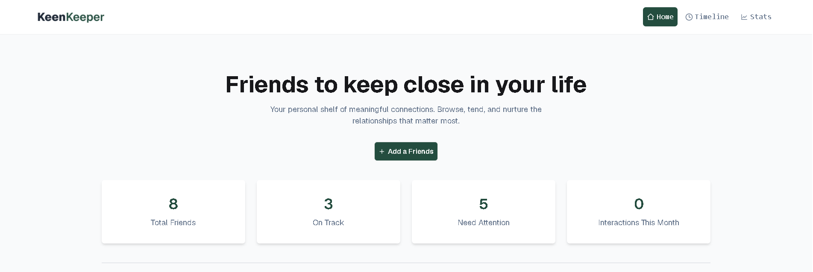
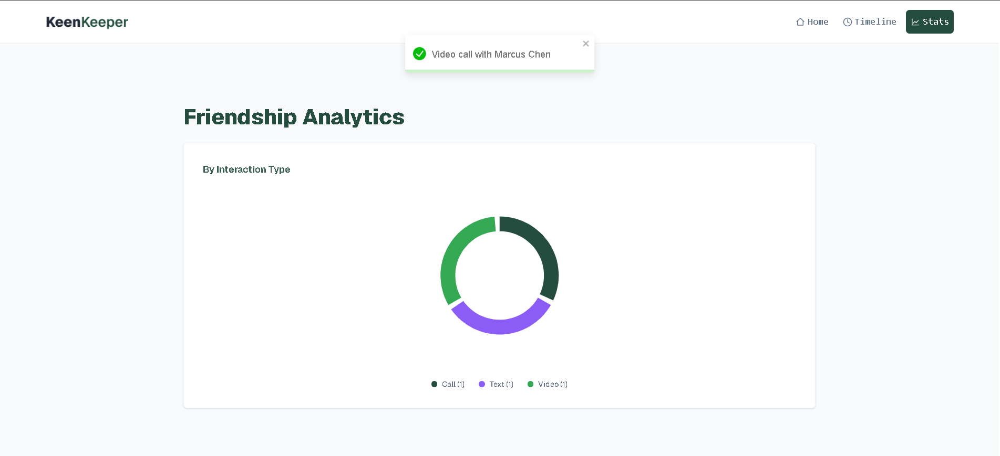
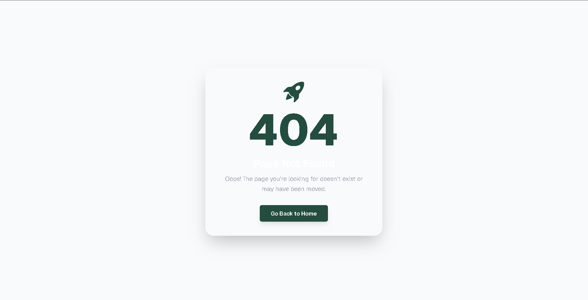

<h1>Project: FriendLoop — Relationship Tracker App</h1>

## 📖 Short Description
A modern and responsive friendship management web application built with React.js.
FriendLoop helps users keep track of meaningful relationships by monitoring communication history, setting friendship goals, and logging interactions like calls, texts, and video chats.

---

## 📌 Project Overview

FriendLoop is designed to help users maintain healthy social connections through a clean and interactive interface. The application allows users to:

- Track how long it has been since contacting friends
- Log calls, texts, and video interactions
- View relationship timelines
- Analyze communication patterns visually
- Manage friendship goals efficiently

The project follows a fully responsive design and includes modern UI/UX practices inspired by a Figma layout.

---

✨ Key Features
🔝 Responsive Navigation System
- Fully responsive Navbar
- Active route highlighting
- Icons with navigation links
- Mobile, tablet, and desktop optimized

👫 Friend Management
- Dynamic friend cards loaded from local JSON data
- Detailed friend profiles
- Status-based UI indicators
- Relationship goals and next due dates

⚡ Interaction Tracking
- Quick Check-In actions:
   - 📞 Call
   - 💬 Text
   - 🎥 Video
- Automatically generates timeline entries
- Real-time toast notifications

📜 Timeline System
- Complete interaction history
- Filter timeline entries by:
   - Call
   - Text
   - Video

📊 Friendship Analytics
- Pie Chart visualization using Recharts
- Displays communication activity statistics

🛠️ Additional Features
- Loading animation while fetching data
- Custom 404 page
- Route reload support after deployment
- Fully responsive layout across all devices

---

🧰 Technologies Used
| Technology                  | Purpose                     |
| --------------------------- | --------------------------- |
| React.js                    | Frontend UI Development     |
| React Router DOM            | Routing & Navigation        |
| Tailwind CSS                | Styling & Responsive Design |
| DaisyUI / Component Library | UI Components               |
| Recharts                    | Data Visualization          |
| React Icons                 | Icons                       |
| React Toastify / Sonner     | Toast Notifications         |
| JavaScript (ES6+)           | Application Logic           |

---

🌟 Future Improvements
- Authentication system
- Cloud database integration
- Real-time syncing
- Reminder notifications
- Dark/Light theme toggle

---

📸 Screenshots

